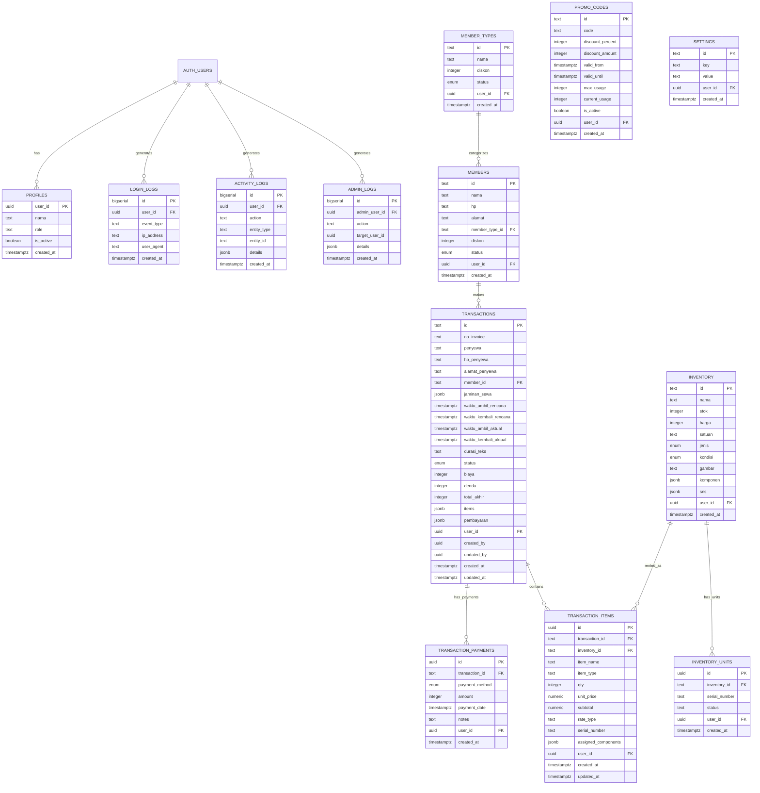
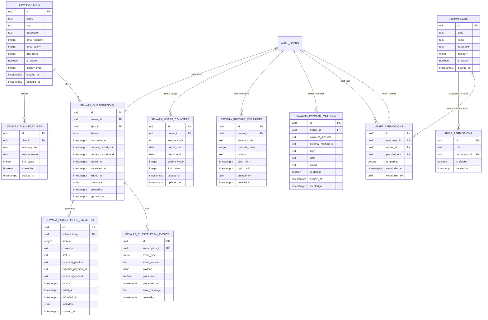

# Entity Relationship Diagram (ERD)

**Project:** Sewara Apps  
**Last Updated:** 30 August 2026  
**Total Tables:** 28

---

## Visual ERD (Mermaid Diagram)

### Business Rental Domain



---

### SaaS Platform Domain



---

## Relationship Summary

### One-to-Many Relationships

| Parent Table | Child Table | Relationship | FK Column |
|--------------|-------------|--------------|-----------|
| `auth.users` | `profiles` | 1:1 | `user_id` |
| `auth.users` | `sewara_subscriptions` | 1:1 | `owner_id` |
| `auth.users` | `login_logs` | 1:many | `user_id` |
| `auth.users` | `activity_logs` | 1:many | `user_id` |
| `auth.users` | `sewara_usage_counters` | 1:many | `owner_id` |
| `auth.users` | `sewara_payment_methods` | 1:many | `owner_id` |
| `member_types` | `members` | 1:many | `member_type_id` |
| `members` | `transactions` | 1:many | `member_id` |
| `inventory` | `inventory_units` | 1:many | `inventory_id` |
| `inventory` | `transaction_items` | 1:many | `inventory_id` |
| `transactions` | `transaction_items` | 1:many | `transaction_id` |
| `transactions` | `transaction_payments` | 1:many | `transaction_id` |
| `sewara_plans` | `sewara_plan_features` | 1:many | `plan_id` |
| `sewara_plans` | `sewara_subscriptions` | 1:many | `plan_id` |
| `sewara_subscriptions` | `sewara_subscription_payments` | 1:many | `subscription_id` |
| `sewara_subscriptions` | `sewara_subscription_events` | 1:many | `subscription_id` |
| `permissions` | `role_permissions` | 1:many | `permission_id` |
| `permissions` | `staff_permissions` | 1:many | `permission_id` |

### Tenant Isolation Pattern

Semua tabel bisnis rental menggunakan `user_id` sebagai tenant key:

```
auth.users (owner)
    ├── inventory (user_id)
    ├── inventory_units (user_id)
    ├── transactions (user_id)
    ├── transaction_items (user_id)
    ├── transaction_payments (user_id)
    ├── members (user_id)
    ├── member_types (user_id)
    ├── promo_codes (user_id)
    ├── settings (user_id)
    └── activity_logs (user_id)
```

Semua tabel SaaS platform menggunakan `owner_id`:

```
auth.users (owner)
    ├── sewara_subscriptions (owner_id)
    ├── sewara_usage_counters (owner_id)
    ├── sewara_feature_overrides (owner_id)
    └── sewara_payment_methods (owner_id)
```

---

## Cross-Domain Relationships

### Business ↔ SaaS Integration

```
auth.users (owner)
    ├── Business Domain (via user_id)
    │   ├── inventory
    │   ├── transactions
    │   └── members
    │
    └── SaaS Domain (via owner_id)
        ├── sewara_subscriptions (active plan)
        ├── sewara_usage_counters (current usage)
        └── sewara_feature_overrides (custom limits)
```

**Usage Check Flow:**
1. User creates transaction
2. Check `sewara_subscriptions` (active?)
3. Check `sewara_feature_overrides` (custom limit?)
4. Check `sewara_plan_features` (plan limit?)
5. Check `sewara_usage_counters` (current usage)
6. Allow/deny action based on limit

---

## Data Flow Examples

### Transaction Creation Flow

```
User creates transaction
    ↓
transactions (main record)
    ↓
transaction_items (items detail)
    ↓
transaction_payments (payment records)
    ↓
inventory.stok (decrement)
    ↓
activity_logs (log action)
    ↓
sewara_usage_counters (increment usage)
```

### Subscription Payment Flow

```
Payment Gateway (Midtrans/Xendit/Stripe)
    ↓
Webhook → /api/webhooks/payment
    ↓
sewara_subscription_events (log raw payload)
    ↓
Process event
    ↓
sewara_subscription_payments (record payment)
    ↓
sewara_subscriptions (update status)
    ↓
sewara_usage_counters (reset if new period)
```

### Permission Check Flow

```
User attempts action
    ↓
Check profiles.role (owner/supervisor/cs/gudang)
    ↓
If owner → allow all
    ↓
Check staff_permissions (custom override?)
    ↓
If override found → use is_granted value
    ↓
Else → check role_permissions (default)
    ↓
Allow/deny action
```

---

## Normalization Level

**Business Tables:** 3NF (Third Normal Form)
- No transitive dependencies
- JSONB used only for flexible/historical data

**SaaS Tables:** 3NF
- Proper FK relationships
- Normalized payment/event data

**Denormalized Fields (by design):**
- `transaction_items.item_name` — snapshot (inventory name may change)
- `transaction_items.unit_price` — snapshot (price may change)
- `transaction_items.item_type`, `rate_type`, `serial_number`, `assigned_components` — item rental details
- `transactions.penyewa`, `hp_penyewa`, `alamat_penyewa` — customer snapshot (member data may change)

**JSONB Usage (intentional):**
- `transactions.jaminan_sewa` — flexible structure (KTP/SIM/etc)
- `inventory.komponen` — bundling components (flexible structure)
- `transactions.items` — LEGACY fallback (dual-write)
- `transactions.pembayaran` — LEGACY fallback (dual-write)
- `inventory.sns` — LEGACY fallback (dual-write)

---

## Cascade Behavior

### ON DELETE CASCADE

**Parent → Child (auto-delete):**
- `inventory` DELETE → `inventory_units` CASCADE
- `transactions` DELETE → `transaction_items` CASCADE
- `transactions` DELETE → `transaction_payments` CASCADE
- `sewara_plans` DELETE → `sewara_plan_features` CASCADE
- `sewara_subscriptions` DELETE → `sewara_subscription_payments` CASCADE
- `auth.users` DELETE → `profiles` CASCADE
- `auth.users` DELETE → `sewara_subscriptions` CASCADE
- `auth.users` DELETE → `sewara_usage_counters` CASCADE
- `auth.users` DELETE → `sewara_payment_methods` CASCADE
- `permissions` DELETE → `role_permissions` CASCADE
- `permissions` DELETE → `staff_permissions` CASCADE

### ON DELETE SET NULL

**Parent DELETE → Child FK = NULL:**
- `members` DELETE → `transactions.member_id` SET NULL
- `member_types` DELETE → `members.member_type_id` SET NULL
- `inventory` DELETE → `transaction_items.inventory_id` SET NULL
- `sewara_subscriptions` DELETE → `sewara_subscription_events.subscription_id` SET NULL

---

## Indexes for Performance

### Critical Indexes

**Foreign Keys (all indexed for JOIN performance):**
- All `user_id` columns
- All `owner_id` columns
- All FK columns (inventory_id, transaction_id, plan_id, etc)

**Timestamp Indexes:**
- `created_at DESC` — recent records
- `updated_at DESC` — tracking changes
- `payment_date DESC` — recent payments

**Status/Category Indexes:**
- `transactions.status` — filter by status
- `sewara_subscriptions.status` — active subscriptions
- `sewara_subscriptions.current_period_end` — expiring subscriptions

**Composite Indexes:**
- `(user_id, key)` — settings lookup
- `(user_id, code)` — promo codes lookup
- `(owner_id, feature_code, period_start)` — usage counters lookup
- `(staff_user_id, owner_id)` — staff permissions lookup

---

## Future Schema Changes (Planned)

### Multi-Branch Support (Future Update)
**Impact:** High complexity

Add `branches` table and `branch_id` to all business tables:
- Change RLS from `user_id` to `branch_id`
- Staff assigned per branch
- Owner can view all branches

### Auth Migration (Future Update)
**Impact:** Medium complexity

Migrate from Supabase Auth to custom auth:
- Replace FK from `auth.users` to `users` table
- Update RLS policies
- Migrate existing user data

### Inventory Rates (Future Enhancement)
**Impact:** Low complexity

Add `inventory_rates` table for dynamic pricing:
- Different rates per duration (hourly/daily/weekly)
- Seasonal pricing
- Member-specific pricing

---

**Last Updated:** 30 August 2026  
**Maintained by:** Development Team  
**See also:** `SCHEMA.md`, `MIGRATIONS.md`
